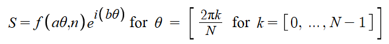
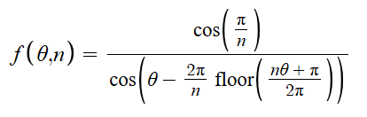
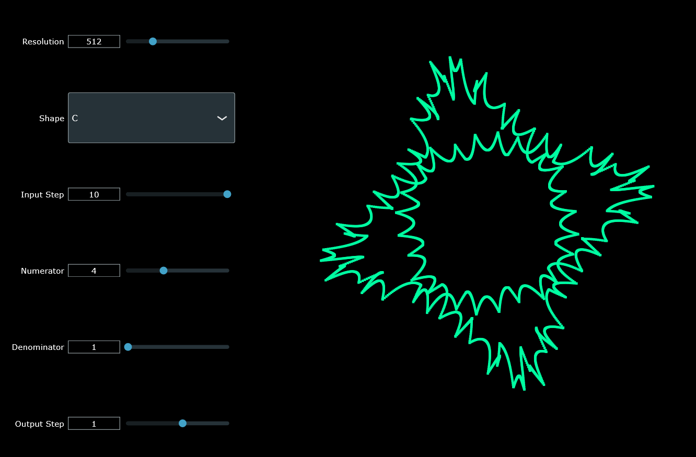

# Quadratic  Visualizer

VST3 Plugin that uses TheGrayCuber's [Cursed Quadratic Equations](https://www.youtube.com/watch?v=ocDnfeFAsCg) to visualize audio.

# Installation

Go to [Releases](https://github.com/HappyAcccident/Quadratic-Visualizer-Plugin/releases) and either use the Windows installer or place the VST3 directly into "C:\Program Files\Common Files\VST3" (you may have to create this directory if you haven't installed a VST3 before).

# Math

The shape, R, seen on the visualizer is the solution to the equation AR^2 + BR + C = 0, with A, B, and C, being shapes.

Each of these shapes is a set of complex points generated by the function  where a is the input step, n is the number of sides (can be a float), and b is the output step.

The function f(theta, n) is a polar function that returns the magnitude of a regular polygon with n sides at angle theta from the x-axis (counter clockwise).

# Usage

The Resolution slider controls the number of points each of the positive and negative roots has (if the slider is set to 500, there would be 1000 points total). Turning this slider down helps with performance.

The Shape drop down box lets you change the parameters for shapes A, B, or C. (A, B, and C being the coefficients in the equation AR^2 + BR + C = 0).

The Input Step slider changes the input step (a, in the shape generation function).

The numerator and denominator sliders change the value n in the shape generation function where n = numerator/denominator.

The Output Step slider changes the output step (b, in the shape generation function).

# Video

[CLICK HERE FOR COOL AWESOME EXAMPLE VIDEO](https://www.youtube.com/embed/tgbNymZ7vqY)

<iframe width="420" height="315"
src="https://www.youtube.com/embed/tgbNymZ7vqY">
</iframe>